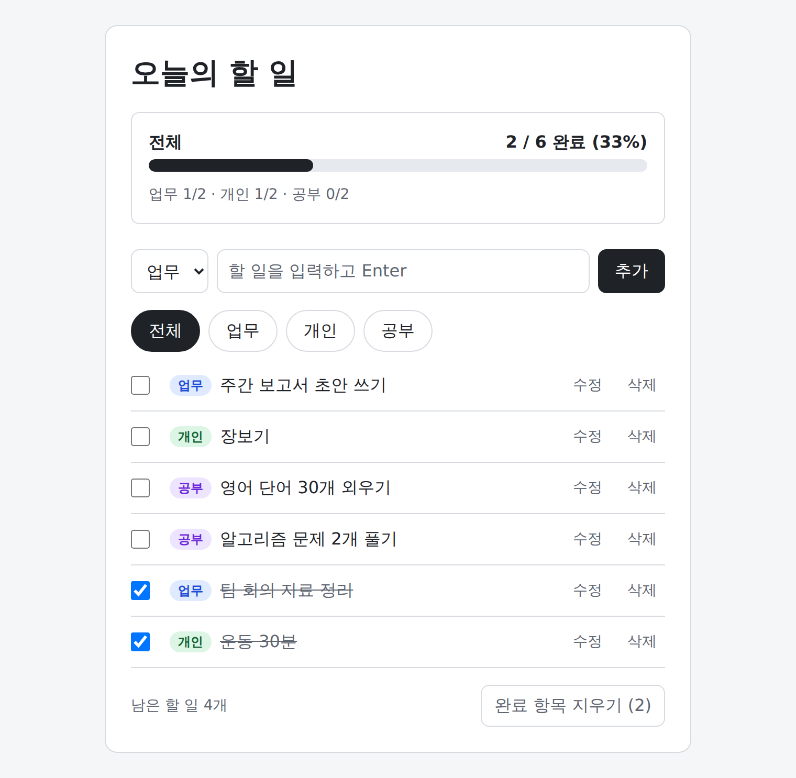

# Study02_ToDoList

매일 10~20개의 할 일을 관리하는 개인용 할 일 관리 앱입니다.
설치나 서버 없이 브라우저에서 `index.html`을 열면 바로 실행되고, 새로고침해도 데이터가 유지됩니다.

> 현재 상태: **구현 완료 (PRD v2.0 기준)**. 요구사항은 [PRD.md](PRD.md)에 있습니다.

## 바로 사용하기

**https://kjykjy3151-eng.github.io/Study02_ToDoList/**

GitHub Pages로 배포한 주소입니다. 설치 없이 브라우저에서 바로 쓸 수 있습니다.

## 실행 화면



## 주요 기능

- 할 일 추가 (최대 100자), 수정 (더블클릭 또는 [수정], 내용과 카테고리), 삭제 (확인 창)
- 완료 체크와 "완료 항목 지우기"
- 카테고리 분류 (업무 / 개인 / 공부) 및 필터
- 전체 진행률 (`2 / 6 완료 (33%)`와 막대), 카테고리별 진행률 한 줄, 남은 할 일 개수
- 브라우저 저장소(localStorage)에 자동 저장
- 키보드만으로 모든 기능 사용 가능, 휴대폰 폭(360px)에서도 가로 스크롤 없음
- 저장 데이터가 손상됐거나 저장할 수 없는 브라우저에서도 동작하고 안내 문구 표시

## 사용 방법

1. 저장소를 내려받습니다.
2. `index.html`을 더블클릭해 브라우저에서 엽니다. 서버나 설치가 필요 없습니다.

| 하고 싶은 일 | 방법 |
|---|---|
| 할 일 추가 | 카테고리를 고르고 내용을 입력한 뒤 Enter |
| 수정 | 내용을 더블클릭하거나 [수정] → 내용·카테고리를 고치고 Enter로 저장, Esc로 취소 |
| 완료 | 체크박스 클릭 또는 Space (완료 항목은 목록 아래로 이동) |
| 삭제 | [삭제] → 확인 |
| 정리 | [완료 항목 지우기] |
| 카테고리별로 보기 | 필터 버튼 (진행률은 항상 전체 기준, 고른 필터는 새로고침 후에도 유지) |

목록은 미완료 항목이 위, 완료 항목이 아래이고, 각각 추가한 순서대로 보입니다.

데이터는 사용 중인 브라우저에만 저장됩니다. 브라우저의 사이트 데이터를 지우면 할 일도 사라집니다.

## 기술

- HTML, CSS, 순수 JavaScript (프레임워크·라이브러리·빌드 도구 없음)
- 테스트: Node 내장 테스트 도구 (`node:test`)

## 파일 구성

```
index.html                 화면 뼈대
style.css                  스타일
todo-core.js               순수 로직 (상태 변경, 정렬·필터, 진행률, 저장 데이터 검사)
app.js                     화면 그리기, 이벤트 처리, 저장
tests/todo-core.test.js    로직 테스트
PRD.md                     PRD (v2.0)와 구현 메모
PROMPTS.md                 Claude Code 단계별 구현 프롬프트 (PRD v2.0, 단계마다 승인)
ToDoList_v2.png            실행 화면 캡처 (현재)
ToDoList_v1.png            실행 화면 캡처 (PRD v1.0 기준)
README-v1~v4.md            단계별 이전 README
```

## 테스트

Node.js 18 이상이 필요합니다. 별도 패키지 설치는 없습니다.

```bash
node --test
```

## 문서

- [PRD (v2.0)](PRD.md): 요구사항과, 실제 구현이 PRD와 다른 점
- [Claude Code 단계별 구현 프롬프트](PROMPTS.md): PRD v2.0을 5단계로 구현하는 프롬프트 (단계마다 승인)

이전 버전의 README는 작업 단계별로 남겨 두었습니다.

- [README-v1.md](README-v1.md): PRD와 설계를 쓴 직후 (구현 전)
- [README-v2.md](README-v2.md): 구현 프롬프트(PROMPTS.md)를 추가한 직후 (구현 전)
- [README-v3.md](README-v3.md): 구현과 검증을 마친 직후
- [README-v4.md](README-v4.md): 문서를 최상위로 옮기고 실행 화면 캡처를 추가한 직후 (배포 전)
